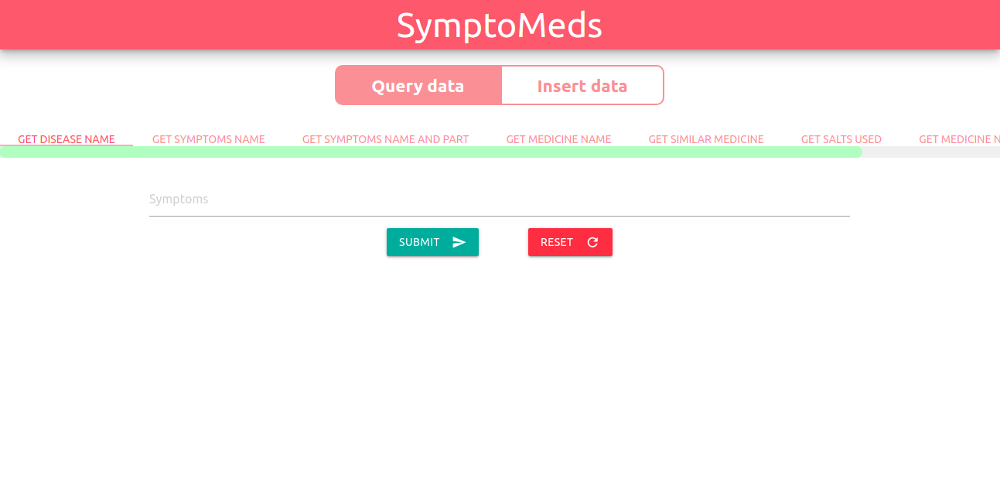
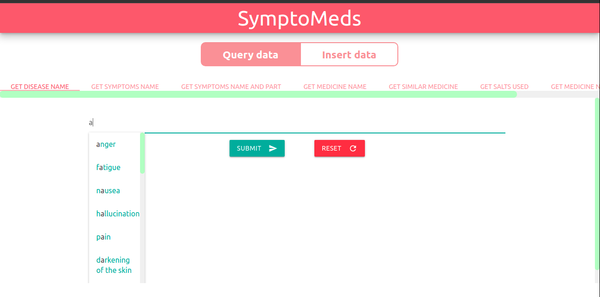
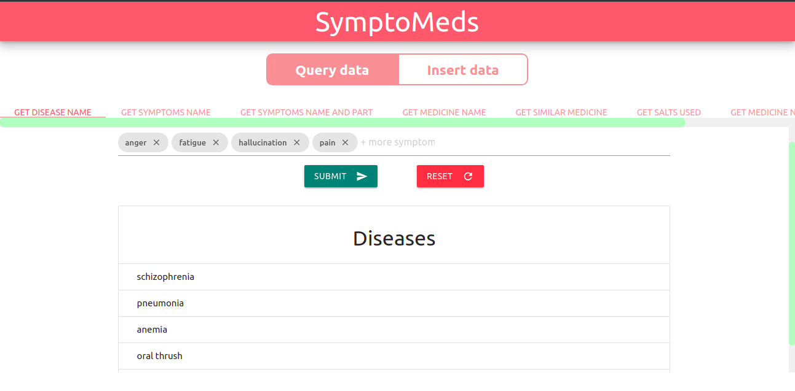
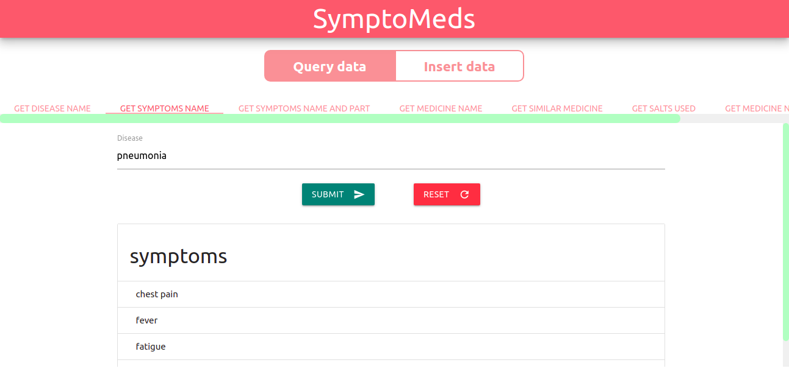
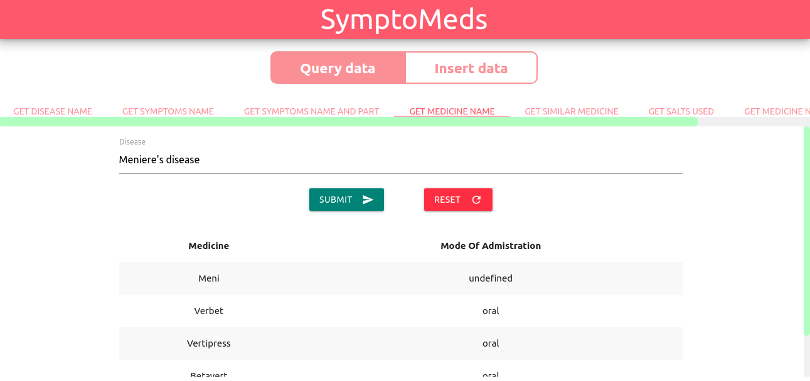
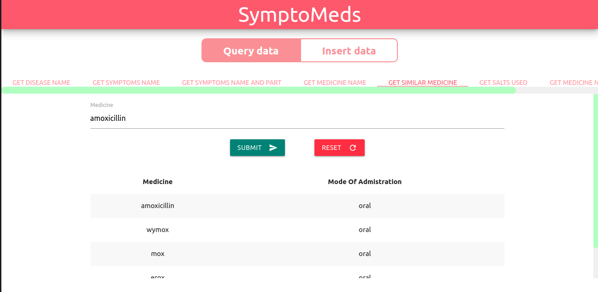
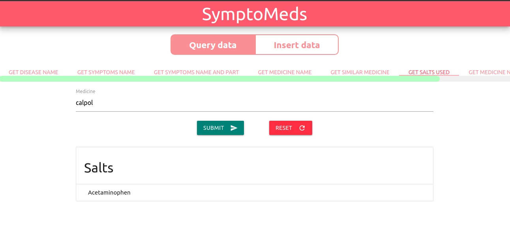
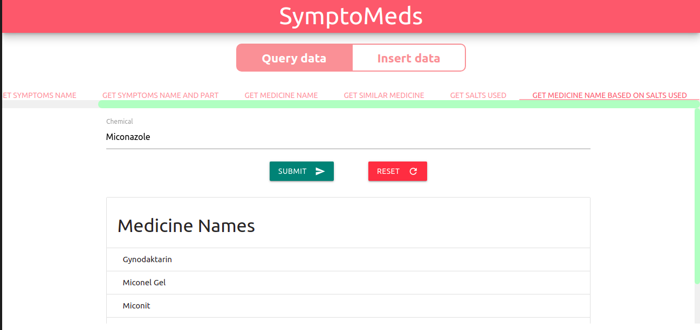
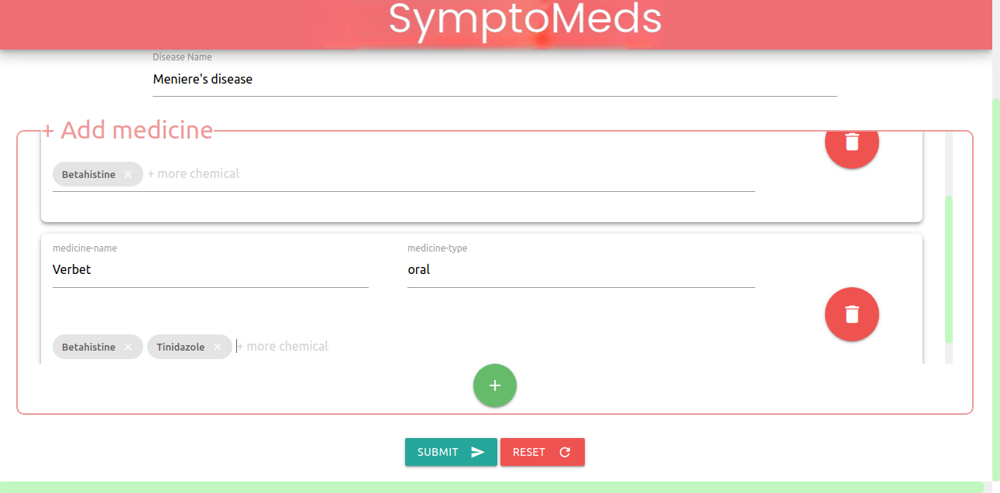
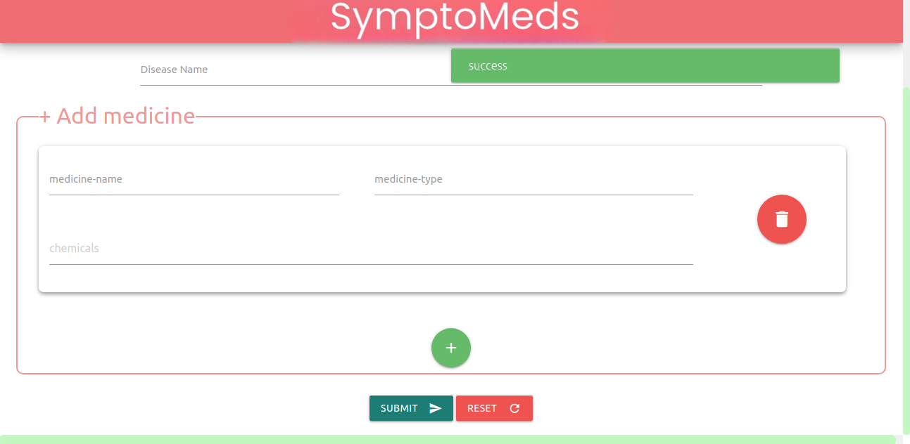

# SymptoMeds An Medicine Search Web App

This web application is created to aid users
in understanding and obtaining knowledge
about multiple different illnesses and medications.
It is user-friendly and provides a
great interactive experience.

&emsp; The application allows users to search
for diseases based on their symptoms.
Users can also get names of medicines
based on the disease they entered.
For example, if a user enters ‘asthma’
as the disease, the application will show the
medicines available for treating asthma.
Furthermore, the application will provide names
of related medicines based on the medicine name
entered. This helps users in finding medicines with
similar properties to the one they have entered.

&emsp; Moreover, the application also
provides the composition used in a particular medicine.
This allows users to understand what components
are used in a particular medicine.
This feature is especially useful for people who
have allergies or any other medical condition that necessitates
them to check the composition of medicines
before taking them.

&emsp; Overall, this web application is designed to be user
friendly and provides a simple and
convenient way for users to access
information on various diseases and
medicines, enabling them to make
informed decisions.

## Web App Features

- Users are able to get the name of a disease based on the symptoms entered.
- Users are able to get the symptoms for a given disease.
- Users are able to get medicines for the treatment of a given disease.
- Users are able to get related medicines according to the medicine name entered.
- Users are able to find the compositions used in the medicine name they entered.

## Lessons Learned

- Learned how to use the Materialize CSS library.
- Learned how to perform complex DOM manipulation.
- Learned how to write complex sql queries
- Leared how to write queries involving multiple joins
- Learned how to work with Flask.
- Learned how to address CORS policy.

## Tech Stack

**Client:** Html,Css,JavaScript,Materialize

**Server:** Python with Flask micro web framework

**Database:** MySql

## Screenshots

### Home Page & Editing Page

    
    &ensp; &ensp;

  
     &ensp; &ensp;
 

### Autocomplete Demo

  
     &ensp; &ensp;
 

### Disease Search Demo

  
     &ensp; &ensp;
 

### Symptom Search Demo

  
     &ensp; &ensp;
 

### Medicine Search Demo

  
     &ensp; &ensp;
 

### Similar Medicine Search Demo

  
     &ensp; &ensp;
 

### Query Medicine Composition Demo

  
     &ensp; &ensp;
 

## Query Medicine Based On Composition Demo

  
     &ensp; &ensp;
 

## Add New Entry Page Demo

  
     &ensp; &ensp;
 

## Add new entry Success Demo.

  
     &ensp; &ensp;
 
